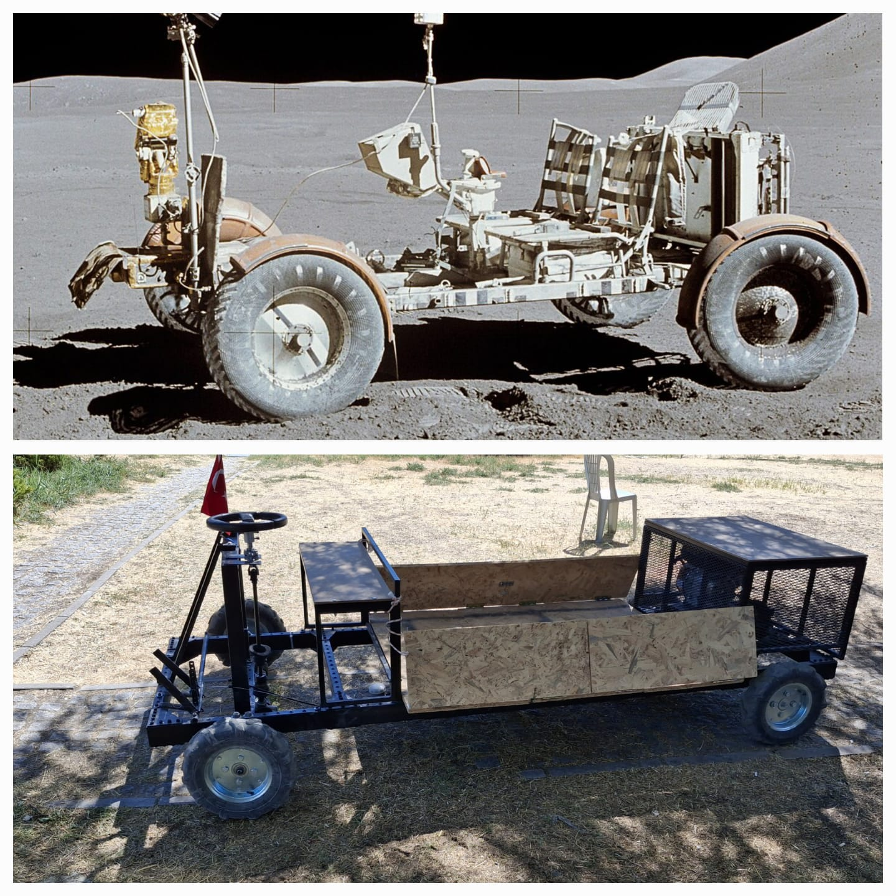

# utility-vehicle-design
4-passenger utility vehicle designed and manufactured for field logistics and equipment transport during the Anatolian Rover Challenge 2025.

This project covers the end-to-end design and fabrication of a 4-passenger utility vehicle specifically developed for the Anatolian Rover Challenge. The primary objective was to create a reliable, high-torque vehicle capable of transporting equipment and personnel across challenging terrain during competition field operations.

Performance & Load Capacity
Structural Payload: Designed for a maximum static load of +650 kg (chassis-limited).

Gradient Performance: Capable of transporting a 650 kg payload on a 15% incline, optimized for competition field terrain.

Powertrain Architecture: * Engine: 7 HP petrol engine @ 3600 RPM.

Transmission: Centrifugal Clutch system and 20:1 Gear Reduction for maximum torque multiplication at low speeds

## Project Gallery

*Figure 1: A humorous comparison between the NASA Apollo 15 LRV (Top) and my 200cc Logistics Vehicle (Bottom).
Separated by 53 years and 384,400 km, both vehicles share the same core engineering goal: reliable transportation in challenging environments...*
